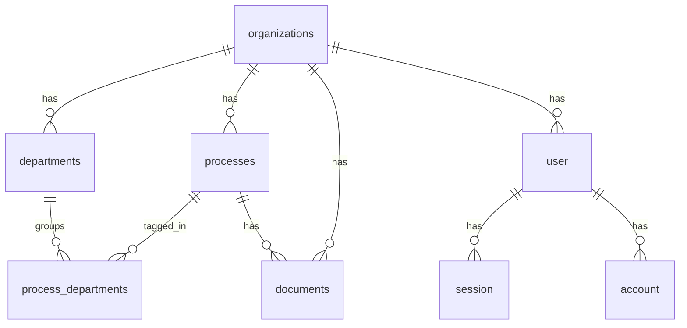

# Database Specification

## Overview

This project uses PostgreSQL with Drizzle ORM.

The database is split into two groups of tables:

- Better Auth tables for authentication and sessions
- Domain tables for organizations, departments, processes, and documents

## Core Business Rules

- A user may or may not belong to an organization.
- An `admin` user does not belong to any organization.
- An `organization_owner` may exist without an organization while creating one.
- A `member` must always belong to an organization.
- Each organization owns its departments.
- Each process belongs to exactly one organization.
- A process may be linked to multiple departments.
- Each document belongs to exactly one process and one organization.
- Each document stores one or more responsible parties as strings.
- Non-admin users can only access processes, departments, and documents from their own organization.
- `organization_owner` users can edit organization data and manage members of their own organization.

## Authorization Model

### User roles

- `admin`
  - global access
  - not linked to an organization
- `organization_owner`
  - may be temporarily unlinked while creating an organization
  - can edit organization data
  - can manage members from the same organization
- `member`
  - linked to one organization
  - can access work resources from the same organization

### Access scope

- `admin` can access data from any organization.
- `member` is always scoped by `organization_id`.
- `organization_owner` is scoped by `organization_id` after being linked to an organization.
- Every query for non-admin users must filter by `organization_id`.

## Authentication Tables

Better Auth is the source of truth for user identity and sessions.

### `user`

Main user table used by Better Auth and by the application domain.

Columns:

- `id`
- `name`
- `email`
- `email_verified`
- `image`
- `role`
- `organization_id`
- `created_at`
- `updated_at`

Rules:

- `email` must be unique.
- `role` must be one of `admin`, `organization_owner`, or `member`.
- `admin` requires `organization_id = null`.
- `organization_owner` may have `organization_id = null` or a valid organization.
- `member` requires `organization_id != null`.

### `session`

Stores active sessions.

Columns:

- `id`
- `token`
- `expires_at`
- `ip_address`
- `user_agent`
- `user_id`
- `created_at`
- `updated_at`

### `account`

Stores provider accounts and credentials for Better Auth.

Columns:

- `id`
- `account_id`
- `provider_id`
- `user_id`
- `access_token`
- `refresh_token`
- `id_token`
- `access_token_expires_at`
- `refresh_token_expires_at`
- `scope`
- `password`
- `created_at`
- `updated_at`

### `verification`

Stores one-time verification data.

Columns:

- `id`
- `identifier`
- `value`
- `expires_at`
- `created_at`
- `updated_at`

## Domain Tables

### `organizations`

Represents institutional data for each organization.

Columns:

- `id`
- `name`
- `slug`
- `created_at`
- `updated_at`

Rules:

- `slug` must be unique across the system.

### `departments`

Represents departments inside an organization.

Columns:

- `id`
- `organization_id`
- `name`
- `slug`
- `created_at`
- `updated_at`

Rules:

- each department belongs to one organization
- `slug` must be unique inside the same organization

### `processes`

Represents work processes that belong to one organization.

Columns:

- `id`
- `organization_id`
- `title`
- `status`
- `created_at`
- `updated_at`

Rules:

- each process belongs to one organization
- process visibility for non-admin users is always organization-scoped

### `process_departments`

Join table for the many-to-many relationship between processes and departments.

Columns:

- `process_id`
- `department_id`
- `created_at`

Rules:

- one process may be linked to many departments
- one department may be linked to many processes
- both records must belong to the same organization at application level

### `documents`

Represents documents linked to a process.

Columns:

- `id`
- `organization_id`
- `process_id`
- `name`
- `storage_key`
- `responsibles`
- `created_at`
- `updated_at`

Rules:

- each document belongs to one process
- each document belongs to one organization
- `responsibles` is a `text[]`
- document visibility for non-admin users is always organization-scoped

## Relationship Summary

## Implementation Notes

- The Better Auth `user` table is also the application user table.
- There is no separate domain-only `users` table.
- `documents.responsibles` intentionally stores strings instead of foreign keys because responsible parties are not restricted to registered users.
- Organization scoping is enforced by application policies and queries, using `organization_id`.
- The `user` table includes a database-level check to keep role and organization consistency valid.
